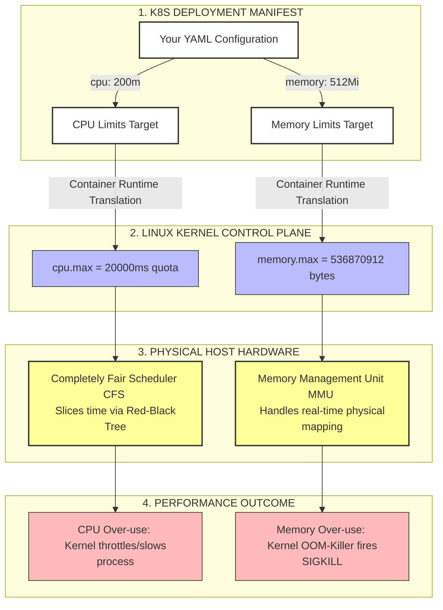
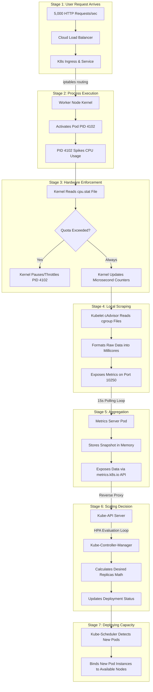

```mermaid
graph TD
    subgraph M1 [Stage 1: App Activity]
        A[Traffic Spike / Memory Leak] --> B[Pod Process Tree PID 4102]
        B --> C[Allocates New RAM Variables]
    end

    subgraph M2 [Stage 2: Hardware Tracking]
        C --> D[Requests RAM Pages from CPU MMU]
        D --> E[Kernel Updates memory.current]
        E --> F[Kernel Checks memory.max Limit]
    end

    subgraph M3 [Stage 3: The Memory Wall]
        F --> G{Limit Breached?}
        G -->|Yes| H[Allocation Fails Instantly]
        H --> I[Kernel Invokes Linux OOM Killer]
        I --> J[Kernel Targets PID 4102 Context]
        J --> K[Sends SIGKILL Signal 9]
        K --> L[Container Crashes Abruptly]
    end

    subgraph M4 [Stage 4: Local Logging]
        L --> M[Kubelet Detects Dead Process]
        M --> N[Runtime reads Exit Code 137]
        N --> O[Sets Pod Status Reason to OOMKilled]
    end

    subgraph M5 [Stage 5: Persistence]
        O -->|Heartbeat Push| P[Kube-API Server]
        P --> Q[Writes State to etcd Cluster Storage]
    end

    subgraph M6 [Stage 6: Self-Healing]
        Q --> R[Kubelet Evaluates restartPolicy]
        R --> S[Creates Fresh cgroup Folders on Node]
        S --> T[Launches Brand New Process PID 6814]
        T -->|If Fails Again| U[Applies CrashLoopBackOff Delay]
    end
```

## 1. The Linux Kernel View: The cgroup Hierarchy TreeThis diagram shows how the Linux kernel organizes everything into branches. Instead of scanning thousands of individual processes, the kernel evaluates limits at the slice and pod levels first, making resource tracking lightning-fast.                  

[ Host Linux Kernel (Root cgroup) ]
                                  │
         ┌────────────────────────┴────────────────────────┐
         ▼                                                 ▼
  [ system.slice ]                                 [ kubepods.slice ]
  (Host SSH, Kubelet, etc.)                 (Total allocation for all pods)
                                                           │
                        ┌──────────────────────────────────┴──────────────────────────────────┐
                        ▼                                                                     ▼
             [ kubepods-burstable.slice ]                                         [ kubepods-guaranteed.slice ]
            (Pods with requests != limits)                                       (Pods with requests == limits)
                        │
                        ▼
            [ pod_UID-1234.slice ]  <── Individual Pod Level
                        │
         ┌──────────────┴──────────────┐
         ▼                             ▼
   [ container-A ]               [ container-B ]
   ├── memory.max=512Mi          ├── memory.max=256Mi   <── Hardware Limits Enforced
   ├── cpu.weight=100            ├── cpu.weight=200     <── CPU Share Ratios Enforced
   ▼                             ▼
 [ Process ID: 4102 ]          [ Process ID: 4109 ]     <── Actual Native Application Processes
 [ Process ID: 4103 ]          [ Process ID: 4110 ]

 ```mermaid
%%{init: {'theme': 'base', 'themeVariables': { 'primaryColor': '#ffffff', 'edgeColor': '#333333' }, 'themeCSS': '.node text { fill: #000000 !important; font-weight: bold; } .node { stroke: #333333 !important; }' }}%%
graph TD
    classDef root fill:#ff7733,stroke:#333,stroke-width:2px;
    classDef slice fill:#ffb3ff,stroke:#333,stroke-width:1px;
    classDef pod fill:#b3d1ff,stroke:#333,stroke-width:1px;
    classDef pid fill:#ffffff,stroke:#333,stroke-dasharray: 5 5;

    Root[Host Linux Kernel Root cgroup]:::root
    
    Root --> SystemSlice[system.slice <br/> Host SSH, Kubelet, etc.]:::slice
    Root --> KubePods[kubepods.slice <br/> Total K8s Allocation]:::slice
    
    KubePods --> Burstable[kubepods-burstable.slice <br/> Requests != Limits]:::slice
    KubePods --> Guaranteed[kubepods-guaranteed.slice <br/> Requests == Limits]:::slice
    
    Burstable --> PodSlice[pod_UID-1234.slice <br/> Individual Pod Level]:::pod
    
    PodSlice --> ContainerA[container-A <br/> memory.max=512Mi <br/> cpu.weight=100]:::pod
    PodSlice --> ContainerB[container-B <br/> memory.max=256Mi <br/> cpu.weight=200]:::pod
    
    ContainerA --> PID4102[Process ID: 4102]:::pid
    ContainerA --> PID4103[Process ID: 4103]:::pid
    ContainerB --> PID4109[Process ID: 4109]:::pid
    ContainerB --> PID4110[Process ID: 4110]:::pid
```


## 2. How the Hardware & Kernel Process the Workload

## This diagram shows the relationship between your Kubernetes Deployment YAML configuration and the physical host hardware, highlighting why there is near-zero performance overhead. 
┌─────────────────────────────────────────────────────────────────────────┐
 │ 1. K8S DEPLOYMENT MANIFEST (Your Input YAML)                           │
 │    resources:                                                           │
 │      limits:                                                            │
 │        memory: "512Mi"  ──────► (Translated by Container Runtime)        │
 │        cpu: "200m"      ──────► (Translated by Container Runtime)        │
 └────────────────────────────────────┬────────────────────────────────────┘
                                      │
                                      ▼
 ┌─────────────────────────────────────────────────────────────────────────┐
 │ 2. LINUX KERNEL CONTROL PLANE (The Software Manager)                    │
 │                                                                         │
 │    [ cgroups pseudo-files ]                                             │
 │    ├── Writes "536870912" bytes to ──► /sys/fs/cgroup/.../memory.max    │
 │    └── Writes "20000" ms quota to ───► /sys/fs/cgroup/.../cpu.max       │
 └────────────────────────────────────┬────────────────────────────────────┘
                                      │
                                      ▼
 ┌─────────────────────────────────────────────────────────────────────────┐
 │ 3. PHYSICAL HOST HARDWARE (The Hardware Enforcers)                      │
 │                                                                         │
 │   ┌──────────────────────────────┐     ┌──────────────────────────────┐ │
 │   │  Memory Management Unit (MMU)│     │  Completely Fair Scheduler   │ │
 │   ├──────────────────────────────┤     ├──────────────────────────────┤ │
 │   │ Rejects memory allocation    │     │ Slices CPU time dynamically  │ │
 │   │ instantly if hardware maps   │     │ using a highly optimized     │ │
 │   │ show the Pod's cgroup has    │     │ Red-Black Tree algorithm     │ │
 │   │ exceeded its maximum bytes.  │     │ at a microsecond interval.   │ │
 │   └──────────────┬───────────────┘     └──────────────┬───────────────┘ │
 └──────────────────┼────────────────────────────────────┼─────────────────┘
                    ▼                                    ▼
 ┌─────────────────────────────────────────────────────────────────────────┐
 │ 4. THE OUTCOME                                                          │
 │   [ Memory Over-use ] ──► Kernel OOM-Killer kills the process (Exit 137)│
 │   [ CPU Over-use ]    ──► Kernel CFS Throttles / slows down the process │
 └─────────────────────────────────────────────────────────────────────────┘




## Core Talking Points for Explaining ThisWhen you are presenting or explaining this concept to others, you can sum it up using these three pillars:The Hierarchy Shorthand: 
## "Linux doesn't manage 10,000 loose processes. It manages a clean, nested folder structure. If a top folder is clear, the kernel doesn't even waste clock cycles checking the subfolders.
## "The CPU Management: "CPU limits don't cap clock speeds; they restrict time windows. If a pod has a 20% limit, the kernel lets it run at full physical hardware speed for 20 milliseconds, and then makes it sit entirely idle for the remaining 80 milliseconds of that time block.
## "The Memory Management: "Memory isn't monitored by heavy software loops running inside the container. It's tracked directly inside the physical memory mapping chips of the host CPU architecture, causing zero drag on the OS performance."

## The End-to-End Request, Resource, and Scaling LifecycleThis diagram traces a real-time scenario: An external user sends heavy traffic to an application, causing a container process to hit its CPU limits, which triggers the host Linux kernel tracking systems, and ultimately prompts the Kubernetes control plane to scale the application out.

[ STAGE 1: THE USER REQUEST ARRIVES ]
  User sends 5,000 HTTP requests per second to the application.
                        │
                        ▼
┌─────────────────────────────────────────────────────────────┐
│ Cloud Load Balancer ──► K8S Ingress Controller ──► Service  │
└──────────────────────────────┬──────────────────────────────┘
                               │ (Network packets routed via iptables)
                               ▼
[ STAGE 2: INSIDE THE WORKER NODE (PROCESS EXECUTION) ]
┌─────────────────────────────────────────────────────────────┐
│ Worker Node Linux Kernel                                    │
│                                                             │
│   1. Network packet activates Process ID 4102 (The Pod)     │
│   2. PID 4102 spikes to handle the heavy workload code       │
└──────────────────────────────┬──────────────────────────────┘
                               │
                               ▼
[ STAGE 3: HOST OS HARDWARE ENFORCEMENT & TRACKING ]
┌─────────────────────────────────────────────────────────────┐
│ Linux Completely Fair Scheduler (CFS) & cgroups             │
│                                                             │
│   1. The kernel looks at: /sys/fs/cgroup/.../cpu.stat       │
│   2. PID 4102 uses its full 20ms allowed quota early        │
│   3. Throttling Action: Kernel pauses PID 4102 for the      │
│      remaining 80ms of the current time window              │
│   4. Kernel updates total CPU microsecond counters in background│
└──────────────────────────────┬──────────────────────────────┘
                               │
                               ▼
[ STAGE 4: LOCAL METRIC SCRAPING ]
┌─────────────────────────────────────────────────────────────┐
│ Kubelet Agent (cAdvisor)                                    │
│                                                             │
│   1. cAdvisor reads the raw CPU text files from the host OS  │
│   2. Formats raw microseconds into K8S "millicores" units   │
│   3. Exposes this data securely on host port 10250          │
└──────────────────────────────┬──────────────────────────────┘
                               │ (Every 15 seconds)
                               ▼
[ STAGE 5: CLUSTER METRIC AGGREGATION ]
┌─────────────────────────────────────────────────────────────┐
│ Metrics Server Pod                                          │
│                                                             │
│   1. Scrapes port 10250 on all worker nodes                 │
│   2. Stores the latest cluster resource snapshot in memory   │
│   3. Exposes it to the cluster via metrics.k8s.io API       │
└──────────────────────────────┬──────────────────────────────┘
                               │ (Reverse proxied through Kube-API Server)
                               ▼
[ STAGE 6: THE SCALING DECISION ]
┌─────────────────────────────────────────────────────────────┐
│ Kube-Controller-Manager (HPA Control Loop)                  │
│                                                             │
│   1. Queries metrics.k8s.io and detects 180% average CPU    │
│   2. Runs the math formula:                                 │
│      Desired = ceil( 2 replicas * ( 180% / 80% target ) )   │
│   3. Calculation determines that 5 replicas are needed       │
│   4. Sends scale instruction updating Deployment manifest   │
└──────────────────────────────┬──────────────────────────────┘
                               │
                               ▼
[ STAGE 7: DEPLOYING NEW CAPACITY ]
┌─────────────────────────────────────────────────────────────┐
│ Kube-Scheduler                                              │
│                                                             │
│   1. Detects new unassigned pod replicas in the cluster     │
│   2. Reviews node cgroup capacities to find open room       │
│   3. Binds new Pod instances to available worker nodes      │
└─────────────────────────────────────────────────────────────┘


## Step-by-Step Breakdown for Presentations

## If you are walking an audience or colleague through this flow, you can highlight the transition between the software layer, hardware layer, and the orchestrator layer using these milestones:

## The Ingestion (Stages 1–2): The traffic hits the actual native Linux process (PID 4102). 
## There is no virtual machine layer slowing down the receipt of the network packets.
## The Bottleneck (Stage 3): The process tries to run as fast as possible to process the HTTP queue. 
## The Linux Kernel steps in at the hardware clock level and throttles the process because its cgroup text files restrict its runtime.
## The Observation (Stages 4–5): The process itself knows nothing about Kubernetes. The cAdvisor engine inside the Kubelet acts as a silent observer, translating host kernel log metrics into standard Kubernetes resource figures.The Resolution 
## (Stages 6–7): The HPA controller calculates the global delta. It acts upon the system by changing the desired configuration, handing the job over to the scheduler to spread the upcoming process trees across the physical server fleet.

## The Out-Of-Memory (OOM) Crash and Recovery LifecycleThis diagram traces what happens when heavy traffic or a memory leak causes a container process to consume too much RAM. Unlike CPU, memory cannot be throttled—so when a hard boundary is crossed, the host OS kernel takes immediate, drastic action to protect the worker node.

[ STAGE 1: THE USER REQUEST / APP ACTIVITY ARRIVES ]
  User traffic spikes, or a buggy code execution path creates a memory leak.
                        │
                        ▼
┌─────────────────────────────────────────────────────────────┐
│ Pod Process Tree (e.g., PID 4102) allocates new variables   │
└──────────────────────────────┬──────────────────────────────┘
                               │
                               ▼
[ STAGE 2: HARDWARE ALLOCATION & TRACKING ]
┌─────────────────────────────────────────────────────────────┐
│ Memory Management Unit (MMU) & Kernel cgroups               │
│                                                             │
│   1. App requests more RAM pages from the CPU's MMU.         │
│   2. Kernel updates the cgroup counter: memory.current      │
│   3. Kernel checks file boundary rule:  memory.max          │
└──────────────────────────────┬──────────────────────────────┘
                               │
                               ▼
[ STAGE 3: THE MEMORY WALL & INTERVENTION ]
┌─────────────────────────────────────────────────────────────┐
│ Linux OS Kernel OOM Killer                                  │
│                                                             │
│   1. The app requests 1 extra megabyte that breaches limits.│
│   2. Linux cannot throttle RAM; allocation fails instantly. │
│   3. Kernel invokes the Out-Of-Memory (OOM) Killer engine.  │
│   4. Kernel targets PID 4102 based on cgroup context.       │
│   5. Action: Sends SIGKILL (Signal 9) to abruptly terminate  │
│      the process tree. The container crashes instantly.     │
└──────────────────────────────┬──────────────────────────────┘
                               │
                               ▼
[ STAGE 4: LOCAL ERROR LOGGING ]
┌─────────────────────────────────────────────────────────────┐
│ Kubelet Node Agent                                          │
│                                                             │
│   1. Kubelet notices the local OS process group has died.   │
│   2. Container Runtime (containerd) reads Exit Code 137    │
│      (128 + Signal 9 SIGKILL).                              │
│   3. Kubelet updates the local Pod Status to:               │
│      Reason: OOMKilled                                      │
└──────────────────────────────┬──────────────────────────────┘
                               │ (Status pushed up via heartbeat)
                               ▼
[ STAGE 5: CONTROL PLANE PERSISTENCE ]
┌─────────────────────────────────────────────────────────────┐
│ Kube-API Server & etcd                                      │
│                                                             │
│   1. Kubelet sends the OOMKilled state to the API Server.    │
│   2. The state is written permanently to cluster storage.   │
│   3. If you run 'kubectl get pods', you now see OOMKilled.  │
└──────────────────────────────┬──────────────────────────────┘
                               │
                               ▼
[ STAGE 6: SELF-HEALING & RECOVERY ]
┌─────────────────────────────────────────────────────────────┐
│ Kubelet (Restart Loop)                                      │
│                                                             │
│   1. Kubelet references the Pod's restartPolicy.            │
│   2. It tells the container runtime to create a fresh       │
│      cgroup folder structure on the same host kernel.       │
│   3. Launches a brand-new process ID (e.g., PID 6814).      │
│   4. If it crashes again immediately, Kubelet applies a    │
│      progressive delay strategy (CrashLoopBackOff).         │
└─────────────────────────────────────────────────────────────┘




# Key Differences to Highlight When Explaining This: 
## When presenting this specific memory scenario to teams, emphasize these core architectural points that distinguish it from CPU management:

## The Instability Factor (No Throttling): CPU over-allocation causes slow code execution (throttling), whereas memory over-allocation causes immediate, violent termination (SIGKILL).
## The Meaning of Exit Code 137: In Linux, an exit code of 137 explicitly means the process was stopped by Signal 9. 
## In a Kubernetes environment, this is almost always the host operating system kernel enforcing the memory.max boundary.
## The CrashLoopBackOff Guardrail: If an application crashes due to a memory leak right at startup, the local Kubelet backs off (waits 10s, 20s, 40s... up to 5 minutes) before recreating the process tree. 
## This architectural cushion ensures a looping, broken application does not exhaust the host worker node's entire system log space.