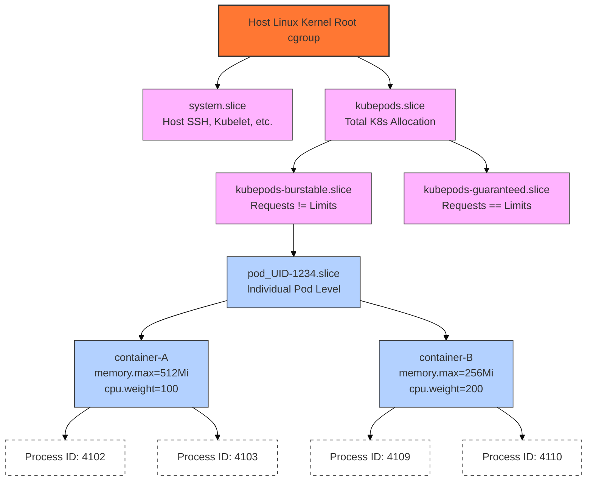
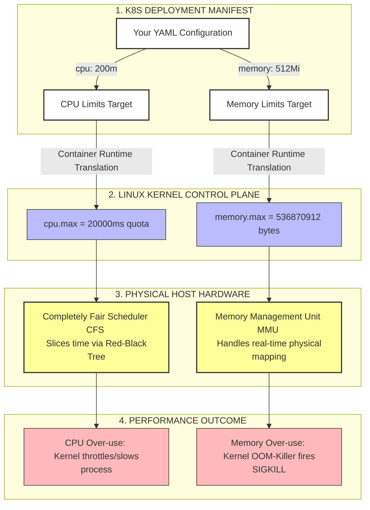
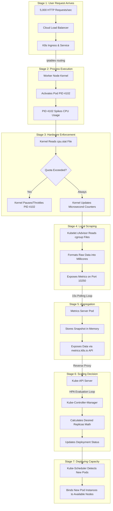

# Kubernetes Resource Flow

This document explains how Kubernetes resource requests and limits become real kernel-level enforcement on a Linux node.

It covers:

- The Linux cgroup hierarchy used by Kubernetes
- How resource limits map to kernel controls
- How CPU and memory are enforced differently
- How the metrics pipeline and HPA scaling decision work
- What happens when a container is OOMKilled

---

## 1. Kubernetes and Linux cgroups

Kubernetes uses Linux cgroups to group and limit container resource usage.

In practice, the kernel does not manage every process individually. Instead, it manages nested cgroup folders, and each Pod becomes a cgroup tree containing its containers.

### Example cgroup hierarchy

```text
[ Host Linux Kernel (Root cgroup) ]
                                  │
         ┌────────────────────────┴────────────────────────┐
         ▼                                                 ▼
  [ system.slice ]                                 [ kubepods.slice ]
  (Host SSH, Kubelet, etc.)                 (Total allocation for all pods)
                                                           │
                        ┌──────────────────────────────────┴──────────────────────────────────┐
                        ▼                                                                     ▼
             [ kubepods-burstable.slice ]                                         [ kubepods-guaranteed.slice ]
            (Pods with requests != limits)                                       (Pods with requests == limits)
                        │
                        ▼
            [ pod_UID-1234.slice ]  <── Individual Pod Level
                        │
         ┌──────────────┴──────────────┐
         ▼                             ▼
   [ container-A ]               [ container-B ]
   ├── memory.max=512Mi          ├── memory.max=256Mi   <── Hardware Limits Enforced
   ├── cpu.weight=100            ├── cpu.weight=200     <── CPU Share Ratios Enforced
   ▼                             ▼
 [ Process ID: 4102 ]          [ Process ID: 4109 ]     <── Actual Native Application Processes
 [ Process ID: 4103 ]          [ Process ID: 4110 ]
```

### What this means

- `kubepods.slice` is the top-level Kubernetes grouping under the host cgroup.
- Pods are placed into different slices based on their QoS class.
- Each Pod gets its own cgroup folder.
- Inside that Pod cgroup, each container has its own limits and weights.
- At the bottom are the real process IDs that run the application.

### Mermaid view



---

## 2. How Kubernetes resource YAML becomes kernel settings

When you define a Pod or Deployment with `resources.requests` and `resources.limits`, the container runtime translates those values into cgroup controls.

### Example mapping

- `cpu: 200m` becomes `cpu.max = 20000` (20ms of CPU time per 100ms window)
- `memory: 512Mi` becomes `memory.max = 536870912` bytes

### Flow from YAML to hardware

1. The deployment manifest defines resource requests and limits.
2. The container runtime writes entries under `/sys/fs/cgroup/...`.
3. The kernel enforces the limits using the CFS scheduler and the MMU.
4. If a process exceeds CPU time, it is throttled.
5. If a process exceeds memory, the kernel OOM killer terminates it.

### Visual summary



---

## 3. Key presentation points

When explaining this flow, emphasize three core ideas:

- **Hierarchy first**: Linux manages nested cgroups, not every process individually. If the parent folder is within limits, the kernel avoids extra work.
- **CPU is time-based**: CPU limits do not lower clock speed. They limit how much time a process can run in a given window.
- **Memory is absolute**: Memory is enforced at the hardware level, so exceeding `memory.max` is not throttled; it is killed.

### Short talking points

- Linux does not scan 10,000 loose processes. It manages a nested folder structure.
- CPU limits let a workload run at full speed for its allotted time slice, then pause it.
- Memory limits are enforced by the hardware memory management unit, with no software loop inside the container.

---

## 4. End-to-end request and scaling lifecycle

This flow shows how external traffic becomes a scaling decision in Kubernetes.

### Summary steps

1. User traffic arrives through the load balancer and Ingress.
2. A worker node kernel schedules the pod process.
3. The process hits CPU quota and gets throttled.
4. cAdvisor reads the raw cgroup metrics.
5. Metrics Server aggregates data and exposes it via metrics.k8s.io.
6. HPA calculates desired replicas and updates the Deployment.
7. The scheduler places new pods on nodes.

### Mermaid flow



---

## 5. What happens during an OOM kill?

Memory is different from CPU. If a container exceeds its `memory.max`, the kernel cannot throttle it—it must kill it immediately.

### Memory failure flow

1. Traffic spikes or a memory leak causes a process to allocate more RAM.
2. The kernel updates `memory.current` and checks `memory.max`.
3. If the limit is exceeded, allocation fails immediately.
4. The kernel triggers the OOM killer.
5. The process receives `SIGKILL` and exits with code `137`.
6. Kubelet records the failure and updates pod status to `OOMKilled`.
7. Kubelet may restart the pod based on the restart policy, or enter `CrashLoopBackOff`.

### Mermaid flow



```mermaid
graph TD
    subgraph M1 [Stage 1: App Activity]
        A[Traffic Spike / Memory Leak] --> B[Pod Process Tree PID 4102]
        B --> C[Allocates New RAM Variables]
    end

    subgraph M2 [Stage 2: Hardware Tracking]
        C --> D[Requests RAM Pages from CPU MMU]
        D --> E[Kernel Updates memory.current]
        E --> F[Kernel Checks memory.max Limit]
    end

    subgraph M3 [Stage 3: The Memory Wall]
        F --> G{Limit Breached?}
        G -->|Yes| H[Allocation Fails Instantly]
        H --> I[Kernel Invokes Linux OOM Killer]
        I --> J[Kernel Targets PID 4102 Context]
        J --> K[Sends SIGKILL Signal 9]
        K --> L[Container Crashes Abruptly]
    end

    subgraph M4 [Stage 4: Local Logging]
        L --> M[Kubelet Detects Dead Process]
        M --> N[Runtime reads Exit Code 137]
        N --> O[Sets Pod Status Reason to OOMKilled]
    end

    subgraph M5 [Stage 5: Persistence]
        O -->|Heartbeat Push| P[Kube-API Server]
        P --> Q[Writes State to etcd Cluster Storage]
    end

    subgraph M6 [Stage 6: Self-Healing]
        Q --> R[Kubelet Evaluates restartPolicy]
        R --> S[Creates Fresh cgroup Folders on Node]
        S --> T[Launches Brand New Process PID 6814]
        T -->|If Fails Again| U[Applies CrashLoopBackOff Delay]
    end
```

### Important memory facts

- CPU overuse slows a process down; memory overuse kills it.
- Exit code `137` means the process was terminated by `SIGKILL`.
- In Kubernetes, `OOMKilled` usually means the host kernel enforced the container memory boundary.
- `CrashLoopBackOff` exists to prevent repeated failures from exhausting node resources.

---

## 6. Summary

Kubernetes resource limits are not abstract suggestions. They become real Linux kernel controls:

- CPU limits are enforced by the scheduler as time quotas.
- Memory limits are enforced by the MMU and the kernel’s OOM killer.
- Metrics flow from cgroups to cAdvisor to Metrics Server to the HPA controller.
- The controller makes scaling decisions based on the observed cluster state.

This flow explains why resource requests matter, why limits are enforced immediately, and why Kubernetes uses the underlying Linux kernel rather than a separate virtualized control plane.
